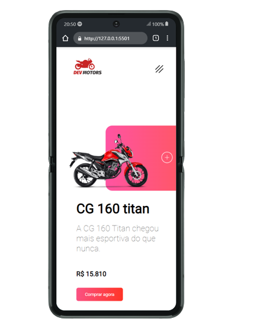

<h1 align="center"> Dev Motors </h1>

Este é um projeto chamado "Dev Motors", que se trata de uma loja virtual de motos.
  A página conta com um menu de navegação que direciona o usuário para diferentes páginas ou categorias, como consórcios, financiamentos e seguros.
  A página principal apresenta informações sobre a CG 160 Titan, incluindo seu preço,características e opção de compra.
  Também há uma imagem da moto que pode ser  visualizada em diferentes cores ao clicar no botão
  No final da página, há links para as redes sociais associadas à empresa. Nesse projeto utilizei HTML, CSS e JavaScript
  para criar uma interface responsiva e interativa com o usuário. 

  
 
    
